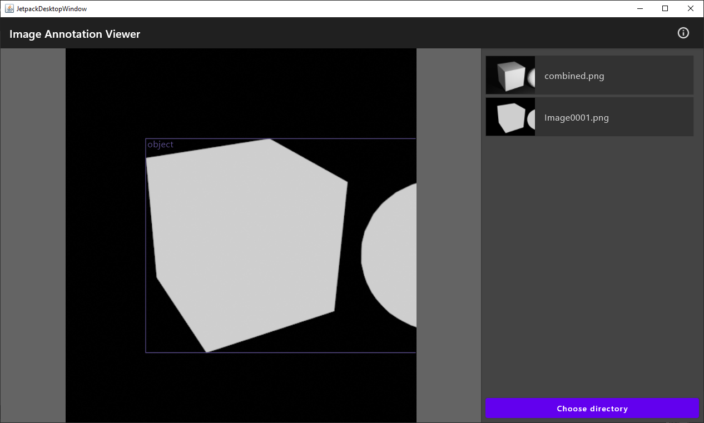

# Image Annotation Viewer

This program is a small weekend project to display image annotations written in Kotlin. It provides very basic functionality. Currently, only the [PASCAL VOC format](http://host.robots.ox.ac.uk/pascal/VOC/) is supported, but adding support for other formats should be easy (feel free to create a pull request!). 

Powered by [Compose for Dekstop](https://www.jetbrains.com/lp/compose/). The UI code is adopted from the Compose for Dekstop examples [codeviewer](https://github.com/JetBrains/compose-jb/tree/master/examples/codeviewer) and [imageviewer](https://github.com/JetBrains/compose-jb/tree/master/examples/imageviewer).
